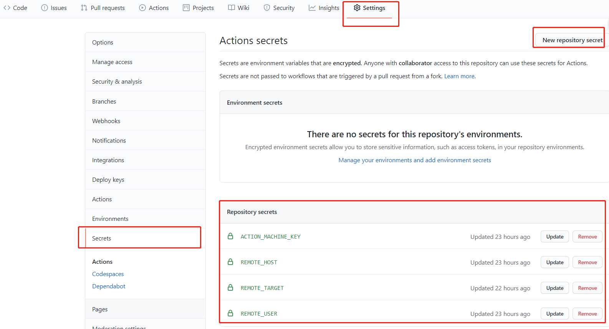

> 使用 VuePress 搭建个人博客，并通过 Github Actions 部署到云服务器

<!-- more -->

## 1. 搭建

我选择的是 [meteorlxy](https://github.com/meteorlxy/vuepress-theme-meteorlxy) 大佬的主题，直接按照他的文档安装、配置就可以了。

## 2. 部署

**Github Action + Cloud Virtual Machine（CVM）**

VuePress 构建后的结果是博客的静态文件，这些静态文件可以部署在 Github Page 上，也可以部署在一些提供静态文件托管的服务上（云服务器厂商一般都有提供），不过我打算将其部署到我的一台闲置了好久的服务器上。

传统的部署静态网站的方法就是将静态文件复制到服务器上，每次发布博客时都要操作一遍，这样很麻烦。想到 Gitlab 具有 CI/CD 的功能，那么 Github 是不是也有呢。幸运的是 Github 提供了 [Github Action](https://docs.github.com/en/actions) 的功能，能帮助我们实现持续集成和部署。这里有一篇阮一峰老师的 [GitHub Actions 入门教程](http://www.ruanyifeng.com/blog/2019/09/getting-started-with-github-actions.html)。

**Github Actions 基本概念：**

1. workflow：工作流程，即一次持续集成运行的过程。
2. job：任务，一次持续集成的运行，可以完成多个任务。
3. step：步骤，一个任务可执行多个步骤。
4. action：动作或命令，一个步骤可以依次执行一个或多个命令。

**部署工作两步走：**

1. 配置 Github Action
2. 配置云服务器

### 2.1 配置 Github Action

在项目中新建 `.github/workflows` 目录，在该目录下新建一个以 `.yaml` 为扩展名的配置文件，文件名任意，我这里取名为 `deploy.yaml`。配置文件内容如下：

```yaml
# 工作流程的名称
name: Deploy to CVM
# 监听 master 分支的 push 操作
on:
  push:
    branches:
      - master
jobs:
  # 任务名为 "Build-and-Deploy"
  Build-and-Deploy:
    runs-on: ubuntu-latest
    # 一系列步骤
    steps:
      # 切换到 master 分支
      - name: Checkout master
        uses: actions/checkout@v2
        with:
          ref: 'master'
      # 使用 Node 12 版本
      - name: Use Node.js 12
        uses: actions/setup-node@v2
        with:
          node-version: '12'
      # 安装依赖和构建
      - name: Yarn install and Build
        run: |
          yarn install
          yarn build
      # 部署到云服务器
      - name: Deploy to CVM
        uses: easingthemes/ssh-deploy@v2.1.7
        env:
          SSH_PRIVATE_KEY: ${{ secrets.ACTION_MACHINE_KEY }}
          ARGS: "-avz --delete"
          REMOTE_HOST: ${{ secrets.REMOTE_HOST }}
          REMOTE_USER: ${{ secrets.REMOTE_USER }}
          SOURCE: "dist/"
          TARGET: ${{ secrets.REMOTE_TARGET }}
          EXCLUDE: "/dist/, /node_modules/"
```

配置文件的某些步骤里面使用了如 `actions/xxx` 的东西，这是什么呢？实际上有很多操作在不同的项目里面是类似的，完全可以共享，于是 Github 提供了一个官方市场，里面有很多他人写好的脚本，我们直接拿来用就好了。

我用到了如下三个他人写好的 Action：

1. [actions/checkout](https://github.com/actions/checkout)：官方 Action，在当前项目下执行切换分支的操作
2. [actions/setup-node](https://github.com/actions/setup-node)：官方 Action，设置接下来执行的命令所依赖的 node 环境
3. [easingthemes/ssh-deploy](https://github.com/easingthemes/ssh-deploy)：第三方 Action，使用 rsync 通过 SSH 部署代码

最后一个步骤是将代码部署到云服务器，里面使用 env 定义了一些该步骤所需要的环境变量，具体有哪些环境变量可以查看 [ssh-deploy 文档](https://github.com/easingthemes/ssh-deploy#configuration)。

将代码部署到云服务器上是通过一个叫 rsync 的 Linux 应用程序完成的。

> rsync 全称 remote sync，即 “远程同步”，它可以在本地计算机与远程计算机之间，或者两个本地目录之间同步文件（但不支持两台远程计算机之间的同步）。它也可以当作文件复制工具，替代 cp 和 mv 命令 --- [rsync 用法教程](https://www.ruanyifeng.com/blog/2020/08/rsync.html)。

使用 Github Actions 部署代码，即通过 Github 将构建好的代码同步到云服务器。因此，我们需要在云服务器上给博客项目仓库下的 Github Actions 构建机创建一个用户，并为之创建一对公私钥，让其通过 SSH 远程登录到云服务器，将构建好的代码复制到服务器的 nginx 服务的目录下。如此，再来看看 env 定义的环境变量：

1. SSH_PRIVATE_KEY：Github Actions 构建机用户的私钥
2. REMOTE_HOST：远程主机（IP，没试过域名）
3. REMOTE_USER：给 Github Actions 构建机创建的远程用户名
4. SOURCE：源目录，即要被同步到云服务器上的目录，如 dist/
5. TARGET：云服务器上的目标目录，如 /var/www/xxx

`$ 大括号` 包裹起来的部分是一些变量，secrets 变量即当前博客项目的 Repository secrets。进入博客项目仓库，选择 `Settings` 下的 `Secrets` 栏目，便可看到 Repository secrets。如下图所示：



以上就是 Github Actions 的配置，有关 SSH 密钥，Github Actions 构建机用户的设置在下个小节讲。

### 2.2 配置云服务器

再来简单说下代码部署的流程：

1. Github Actions 构建机通过 SSH 远程登录到服务器
2. 通过 rsync 将构建好的代码同步到服务器的目标目录

**创建用户**

```shell
useradd githubaction
passwd githubaction
```

**给用户创建公私钥**

```shell
ssh-keygen
# 接下来会提示将密钥文件保存在哪，我们保存在 /home/githubaction/.ssh 里面
```

在 `/home/githubaction/.ssh` 目录下创建一个 `authorized_keys` 文件，将公钥复制进去；然后回到博客仓库，创建一个 Repository secrets，取名为 SSH_PRIVATE_KEY，将私钥复制进去。这样就可以实现构建机远程登录到服务器了。

**配置 nginx**

```shell
server {
  listen 80;
  server_name 域名或IP;

  root  /home/githubaction/blog;
  index index.html;

  location ~* ^.+\.(jpg|jpeg|gif|png|ico|css|js|pdf|txt){
    root /home/githubaction/blog;
  }

  error_page 404 /404.html;
  location = /404.html {
  }
}
```

我将代码放到了 `/home/githubaction/blog` 目录下，所以回到博客仓库，新建一个 Repository secrets，取名为 `TARGET`，其值为 `/home/githubaction/blog`。注意，想要将代码同步到这个目录下，一定要确保 githubaction 用户对这个目录有可写和可执行的权限。而且，这个目录也需要让 nginx 用户具有可读和可执行的权限，这样 nginx 才能为其提供静态文件服务。最终 `/home/githubaction/blog` 目录的权限为 `rwxr-xr-x`，`/home/githubaction` 目录的权限为 `rwx---r-x`。呃...貌似不安全呢，我这么配置应该有问题，暂且这样吧，我对 linux 的认知较少，操作也不熟练，有错误或不妥的地方还望大佬指正。

还有一点需要注意，就是 `SOURCE` 这个 Repository secrets。有些文章里面将其设置为 `/dist`，但是这样设置的话，在代码同步之后会是这个样子：`/home/githubaction/blog/dist`，即把整个 dist 目录复制到了 TARGET 下。所以应该将 SOURCE 设置为 `dist/` 这样只会复制 dist 目录下的内容，而不会复制 dist 目录本身。

完成 Github Actions 配置和服务器配置后，只需要回到代码仓库，提交代码并 PUSH 到 GIthub，就会触发 Action 啦，我们可以在项目仓库的 Action 选项卡中看到部署的进程。

## 3. 参考文章

- [玩转腾讯云 Github Actions+CVM实践(CICD如此简单)](https://cloud.tencent.com/developer/article/1614404)
- [真香！GitHub Action一键部署](https://zhuanlan.zhihu.com/p/97782842)
- [GitHub Actions 入门教程](http://www.ruanyifeng.com/blog/2019/09/getting-started-with-github-actions.html)
- [rsync 用法教程](https://www.ruanyifeng.com/blog/2020/08/rsync.html)
