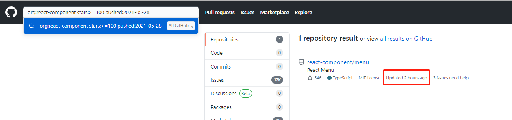

> 高效的利用 Github 搜索项目

<!-- more -->

## 位置限定符: in

限定搜索的位置，常用的有三个地方：

```js
in:name react           // 搜索项目名中包含 react 关键字的仓库

in:readme react         // 搜索 README 中包含 react 关键字的仓库

in:description react    // 搜索项目描述中包含 react 关键字的仓库
```

## 用户或组织限定符: user、org

将搜索的范围限定在某个用户或组织

```js
user:yyx990803          // 搜索 尤雨溪 名下的仓库

org:react-component     // 搜索 react-component 组织下的仓库
```

## 辅助限定符

用于多条件筛选，列举几个常用的

```js
stars:>=100         // 搜索 stars 数大于等于 5k 的仓库（支持大于、小于、等于、大于等于、小于等于）
stars:<=200
stars:1             // 搜索 stars 数为 1 的项目
stars:10..20        // 搜索 stars 数为从 10 到 20 的项目

created:2021-05-28   // 搜索 2021-05-28 之后仍创建的仓库
pushed:2021-05-28   // 搜索 2021-05-28 之后仍更新过的仓库

language:javascript // 搜索使用 javascript 语言的仓库

size:>=1024         // 搜索项目大小大于等于 1MB 的项目（单位 KB）
size:<=512
size:256..512
```

## 类型限定符: type

```js
type:issue jsx      // 搜索 issue 标题中包含 jsx 的 issue
```

---

举个 🌰，搜索 react-component 组织下的，stars 数大于等于 100 且今天更新过的项目：

`org:react-component stars:>=100 pushed:2021-05-28`



---

上面只介绍了 Github 搜索中的冰山一角，不过基本满足日常工作需求，详见官方文档：[官方文档](https://docs.github.com/cn/github/searching-for-information-on-github/getting-started-with-searching-on-github)
